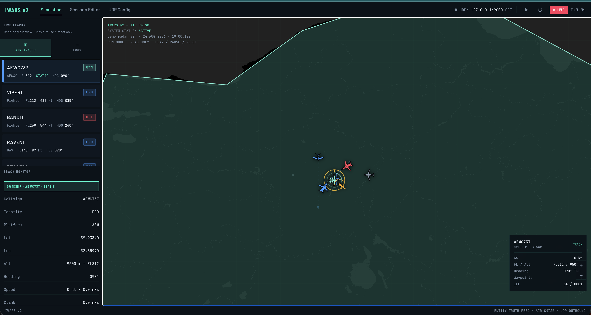

# IWARS v2 — Air C4ISR Entity Truth Feed

C++20 simulation engine + React map editor. IWARS authors **entity truth** (tracks, kinematics, IFF) and publishes it over **UDP** to a downstream workplace radar / IFF stimulator. Blip generation happens there — not here.



```
This app (entity truth)  --UDP-->  Workplace radar/IFF app  -->  blips
```

UDP packet layout is a placeholder (`IWP2`) until the real DSS/radar format is provided.

---

## What it does

IWARS is an **entity truth feed** for air C4ISR pictures:

- Place and move air tracks on a map (fighters, AEW, UAV/UCAV, civil, unknown, …)
- Assign affiliation (friend / hostile / unknown / …) and IFF (Mode 3/A squawk, Mode C/4/5)
- Play the scenario: tracks fly heading/speed or follow waypoint routes on a sphere
- Stream live state to the UI over WebSocket
- Optionally broadcast truth packets over UDP while the sim is running

Every scenario always includes a static AEW ownship (**AEWC737**). It cannot be deleted and never moves.

---

## Architecture

```
┌─────────────────────┐     HTTP :8080      ┌──────────────────────┐
│  React + Leaflet UI │◄───────────────────►│  iwars_sim (C++20)   │
│  Vite :5173         │     WS   :8081      │                      │
│                     │                     │  Engine  10 Hz tick  │
│  Simulation         │                     │  Scenario JSON I/O   │
│  Scenario Editor    │                     │  HTTP + WebSocket    │
│  UDP Config         │                     │  UDP sender (IWP2)   │
└─────────────────────┘                     └──────────┬───────────┘
                                                       │ UDP :9000
                                                       ▼
                                               Workplace radar / IFF
```

| Piece | Role |
| --- | --- |
| `backend/` | C++20 truth engine, REST API, WebSocket broadcast, UDP encoder |
| `frontend/` | React 19 map UI (Simulation, Scenario Editor, UDP Config) |
| `scenarios/` | JSON scenario files loaded at startup and from the editor |

---

## Features

- **Simulation** — live air picture, track list, selected-track telemetry, play / pause / reset
- **Scenario Editor** — add tracks, drag positions, draw waypoint routes, save / load JSON
- **UDP Config** — host, port, enable/disable outbound truth feed
- **Ownship** — AEWC737 is always present, static, and protected from delete
- **IFF fields** — Mode 3/A squawk, Mode C altitude, Mode 4 / Mode 5 stim flags

---

## Requirements

- CMake ≥ 3.20, a C++20 compiler, OpenSSL, pthread
- Node.js 20+ (frontend)

---

## Run

### Backend

```bash
cmake -S backend -B backend/build
cmake --build backend/build -j
IWARS_SCENARIOS=/root/IWARS-V2/scenarios ./backend/build/iwars_sim
```

Defaults:

| Variable | Default | Meaning |
| --- | --- | --- |
| `IWARS_HTTP_PORT` | `8080` | REST API |
| `IWARS_WS_PORT` | `8081` | Live state WebSocket |
| `IWARS_SCENARIOS` | auto-detected `scenarios/` | Scenario JSON directory |

On startup the engine loads `demo_radar_air.json` if present, otherwise `demo_ankara.json`, otherwise a blank picture centered on Ankara.

### Frontend

```bash
cd frontend
npm install
npm run dev
```

Vite serves on `http://127.0.0.1:5173` and proxies `/api` → `:8080` and `/ws` → `:8081`.

---

## HTTP API

| Method | Path | Description |
| --- | --- | --- |
| `GET` | `/api/health` | Liveness |
| `GET` | `/api/state` | Full scenario + `playing` + `sim_time` |
| `POST` | `/api/control/play` | Start playback |
| `POST` | `/api/control/pause` | Pause playback |
| `POST` | `/api/control/reset` | Restore initial entities, `T=0` |
| `PUT` | `/api/udp` | Set `{ host, port, enabled }` |
| `POST` | `/api/entities` | Create a track |
| `PUT` | `/api/entities/:id` | Update a track |
| `DELETE` | `/api/entities/:id` | Remove a track (ownship is forbidden) |
| `GET` | `/api/scenarios` | List `*.json` files |
| `GET` | `/api/scenarios/:file` | Load file into the engine |
| `POST` | `/api/scenarios` | Save current (or posted) scenario to disk |
| `PUT` | `/api/scenario` | Replace in-memory scenario without saving |

Live ticks are pushed as JSON text frames on `ws://127.0.0.1:8081` (or `/ws` through Vite).

---

## UDP packet (`IWP2` placeholder)

Big-endian on the wire so Linux and Solaris DSS decode the same bytes.

```
magic[4]  = 'I','W','P','2'
version   u16 BE = 2
count     u16 BE
sim_time  f64 BE
per entity:
  id, affiliation, platform, iff_mode, squawk   (u16 BE length + UTF-8)
  lat, lon, alt_m, heading_deg, speed_mps, climb_mps   f64 BE each
  iff_enabled, mode_c, mode_4, mode_5   u8 each
```

Replace `PlaceholderEncoder` when the real radar-stim format arrives.

---

## Scenario JSON

```json
{
  "name": "demo_radar_air",
  "center_lat": 39.9334,
  "center_lon": 32.8597,
  "zoom": 6,
  "udp": { "host": "127.0.0.1", "port": 9000, "enabled": false },
  "entities": [ { "id": "ownship", "name": "AEWC737", "ownship": true, "...": "..." } ]
}
```

Demo pictures live in `scenarios/demo_radar_air.json` and `scenarios/demo_ankara.json`.

---

## License

MIT — see [LICENSE](LICENSE).
